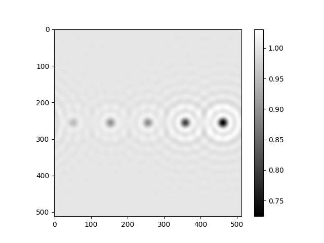
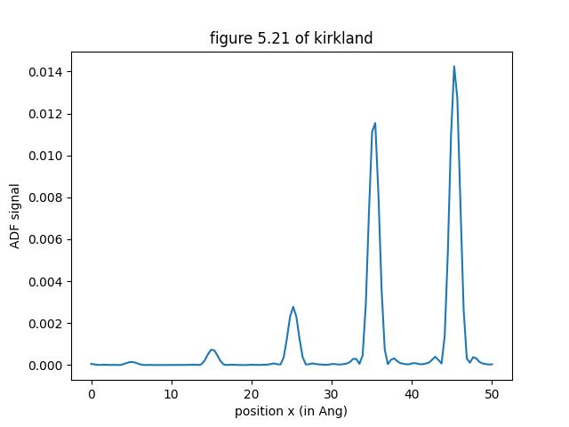
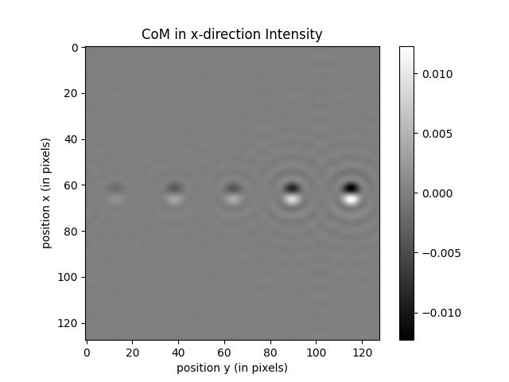

# Elastic-Multislice-Electron-Microscopy
Simulation of elastic scattering in electron microscopy using the multislice algorithm. Simulations include various STEM and TEM techniques such as ADFSTEM, BFSTEM, ABFSTEM and CoM.

The code is written with readability and ease of understanding rather than speed. I've written the code such that it can be easily expanded upon. For example, to begin incorporating inelastic scattering one can calculate the transition potentials and reuse the multislice class. Further, addition elastic scattering techniques can be included by simply specifying the detector function.

## 1. Setup
This code has been tested with C++17 on Ubuntu, ensure that you place your project in a location which can access the header file of the technique you would like to use. You can clone the repo using the command
```
git clone https://github.com/Michael-MD/Electron-Microscopy-in-C.git
```
Next run
```
make
```
This will prepare executable `a.out`.

## 2. Theory
The theory introduced here summarizes the key results of elastic scattering in electron microscopy. Further details can be found in 
Advanced computing in electron microscopy by Earl J. Kirkland which has become the go-to for an introduction to the field.

In electron microscopy, information about the strucutre and constituants of a specimen is inferred by observing the scattering and diffraction of
electrons. Although the incident electrons have energies on the order of 10keV-100keV, the Schrödinger equation is employed with a relativistically 
corrected mass, wavelength and energy.
Given a specimen with potential V(r), the Schrodinger equation reads

$$  -\frac{\hbar^2}{2m} \nabla^2 \Psi - e V(r) \Psi = i\hbar \frac{\partial \Psi}{\partial t} $$

where $m=\gamma m_0$. If we consider energy eigentates with a time-independent hamiltonian, then we obtain the Helmholtz equation

$$ [\nabla^2 + 4 \pi k^2 + 4 \pi U ] \Psi = 0 $$

where $k^2 = \frac{2m e}{h^2}E$ and $U = \frac{2m e}{h^2}V$. Assuming a solution of the form $\Psi = \exp(i 2\pi k z) \psi$ and applying the paraxial approximation this simplifies to

$$ \frac{d\psi}{dz} = \frac{i}{4\pi k} [\nabla_\perp^2 + 4\pi^2 U] \psi  $$

with formal operator solution given by

$$ \psi(r_\perp, \Delta z) = e^{\mathcal{Q} z} \psi(r_\perp, 0)  $$ 

where $\mathcal{Q} = \frac{i}{4\pi k} [\nabla_\perp^2 + 4\pi^2 U_c]$ if $\Delta z$ is small. Here 

$$  U_c(r_\perp) = \int_0^{\Delta z} dz \\, U(r_\perp,z) $$

and is refered to as the projected potential.
Since $\Delta z$ is taken to be small, 

$$ e^{\mathcal Q \Delta z} = e^{(\mathcal T + \mathcal U) \Delta z} = e^{\mathcal T \Delta z} e^{\mathcal U \Delta z} + \mathcal{O}(\Delta z ^2) $$

Now if $\mathcal U = 0$, then the angular spectrum formulation applies to our problem and we may identify the $e^{\mathcal T \Delta z}$ as  the free-space propagotor. So we may propagate the wave function through the specimen through repeted applicaiton of these operators until the wave function is at the exit of the specimen. Mathematically, this may be written as 

$$ \psi(r_\perp, z) = \prod \mathcal F^{-1} \\{ P(k_\perp, \Delta z) \mathcal F\\{ e^{\mathcal U \Delta z} \psi(r_\perp, 0) \\} \\} $$

where $P(k_\perp, \Delta z)$ is the free-space propagator in reciprical space. The approach is referred to as the multislice approach and is the method used here. An interesting note is that the transmission function makes this system not LSI (Linear Shift-Invariant) since shifting the input wave doesn't result in a shifted output. For instance, a probe shifted far from the crystal will barely undergo diffraction if any but it will certainly propagate through free-space in the same way.

The techniques of electron microscopy can be catigoriezed into two primary modes. HR-TEM (High-Resolution Transmission Electron Microscopy) which uses incident place waves and STEM (Scanning Transmission Electron Mircsocopy) which uses
a converged probe which scans across the specimenn surface.

In STEM, for each probe position, a diffraction pattern is obtained, the detector which measures the intensity pattern 
consitiues the various STEM techniques. The recorded signal at a given probe position is given by

$$ g(k) = \int dk \\, |I(k)|^2 D(k) $$

where $D(k)$ is the detector geometry. For instance, ADFSTEM (Annular-Dark-Field STEM) collects electrons which scatter at high
angles.

## 3. Usage
### 3.1 Defining structure of crystal
To image a particular material, a .xyz file containing the crystal atomic species and locations for a single unit cell is to be placed in the structure directory.
This can then be loaded into the program by specifying the file name in the constructor of the technique of interest. 
A few examples are provided in the repo. The file specifies general information about the unit cell at the beginning such as dimensions etc. and then specifies the atoms and locations on the subsequent lines. The template is as follows: <br>

[name] <br>
[unit cell length x] &ensp; [unit cell length y] &ensp; [unit cell length z] &ensp; [basis angle alpha] &ensp; [basis angle beta] &ensp; [basis angle gamma] <br>
[atomic number] &ensp; [fractional x-coord] &ensp; [fractional y-coord] &ensp; [fractional z-coord] &ensp; [occupancy] &ensp; [mean-square displacement] <br>
$\vdots$ <br>
-1 <br>

The code currently doesn't make use of the basis angles, occupancy or msd.

### 3.2 Available Techniques

The available techniques have the following headers:
```
ADFSTEM(float E, int px, int py, int px_p, int py_p, int tx, int ty, int tz, string filename, vector<float> &s,
		float Cs, float deltaf, float alpha_max, float alpha_min_D, float alpha_max_D)
    
ABFSTEM(float E, int px, int py, int px_p, int py_p, int tx, int ty, int tz, string filename, vector<float> &s,
		float Cs, float deltaf, float alpha_max, float alpha_min_D, float alpha_max_D)
    
BFSTEM(float E, int px, int py, int px_p, int py_p, int tx, int ty, int tz, string filename, vector<float> &s,
		float Cs, float deltaf, float alpha_max, float alpha_max_D)
    
CSTEM(float E, int px, int py, int px_p, int py_p, int tx, int ty, int tz, string filename, vector<float> &s,
		float Cs, float deltaf, float alpha_max)
    
HRTEM(float E, int px, int py, int tx, int ty, int tz, string filename, vector<float> &s,
			float Cs, float deltaf, float alpha_max)
      
CoM(float E, int px_p, int py_p, int px, int py, int tx, int ty, int tz, string filename, vector<float> &s,
		float Cs, float deltaf, float alpha_max, bool CoM_dir_x)
```
The inputs are as follows:<br>
<b> E </b>: <br>&emsp;Energy of input beam in eV <br>
<b>(px, py)</b>:<br>&emsp; Dimensions of grid on which calculation is to occur in pixels i.e. the tranmission function, propagator etc. would be calculated on a grid of dimensions (px, py) pixels. <br>
<b>(px_p, py_p)</b>:<br>&emsp; Resolution of STEM scan positions i.e. the number of scan positions in each direction. <br>
<b>(tx, ty, tz)</b>:<br>&emsp; Tiling of unit cell.<br>
<b>filename</b>:<br>&emsp; File name of unit cell. Assumes files is located in directory strcutures/. Currently only .xyz files are supported.<br>
<b>s</b>:<br>&emsp; Vector of slice locations in fractions of unit cell thickness. For instance, if a unit cell is 3.905 Ang. then s = {.2,.8} will result in slices at .2 $\times$ 3.905 = 0.781, .8 $\times$ 3.905 = 3.124.<br>
<b>Cs</b>:<br>&emsp; Sperhical abberation of lens in [mm].<br>
<b>deltaf</b>:<br>&emsp; Lens defocus in Ang.<br>
<b>alpha_max</b>:<br>&emsp; Aperture opening angle in mrad.<br>
<b>alpha_min_D</b>:<br>&emsp; minimum detector angle in mrad. <br>
<b>alpha_max_D</b>:<br>&emsp; maximum detector angle in mrad.<br>

New techniqes can be made by inheritying the multislice class and specifying the function which determines the detector. You may look at the wiki for details or simply look at one of the already existing techniqes as a template.

You may access any of the internal attributes such as the wave function or intensity and write these to a file by including `"general_purpose_utils.h"` which includes a function `writeToFile` which takes in the file name and 2D vector to be written to a file. For example,
```
#include "general_purpose_utils.h"
vector<float> s = {1};
CoM l(2e5, 64, 64, 128, 128, 1,1, 1, "fig511.xyz", s, 1.3, 500, 8.9, true);
writeToFile("I.txt", l.I);
```

### 3.3 Class attributes
All classes have an attribute `layers` which stores the transmission function and propagators for the given layer. For example, continuing from the above example `l.layers[0].t_re` is the real component of the transmission function of the first layer. The propagator can be accessed using `P_re` or `P_im`.

All classes have attribtues `psi_re` and `psi_im` while only STEM techniques have `I` which stores the intensity.

## 4. Examples
Here are a few examples to get you up and running. The code to generate the file and the resulting image produced using a python script which I've inlcuded in the repo named visualize.py. STEM techniques will overwrite the wave function for each probe position so you will need to modify the code slightly to save the vector or otherwise. Secondly, HRTEM doesn't have access to a function which calcaultes the intensity but you may do so using the wave function.
### 4.1 HRTEM
```
#include "general_purpose_utils.h"
#include "HRTEM.h"
#include <vector>
using namespace std;

vector<float> s = {1};
HRTEM l(2e5, 512, 512, 8,8,1, "fig511.xyz", s, 1.3, 700, 10.37);
writeToFile("psi_re.txt", l.psi_re);
writeToFile("psi_im.txt", l.psi_im);
```


### 4.2 ADFSTEM
```
#include "general_purpose_utils.h"
#include "ADFSTEM.h"
#include <vector>
using namespace std;

vector<float> s = {1};
ADFSTEM l(2e5, 1024, 1024, 128, 128, 1,1, 1, "fig511.xyz", s, 1.3, 500, 8.9, 35, 200);
writeToFile("I.txt", l.I);
```


This is a linescan midway through the image obtained in python.

### 4.3 CoM
```
#include "general_purpose_utils.h"
#include "CoM.h"
#include <vector>
using namespace std;

vector<float> s = {1};
CoM l(2e5, 64, 64, 128, 128, 1,1, 1, "fig511.xyz", s, 1.3, 500, 8.9, true);
writeToFile("I.txt", l.I);
```

